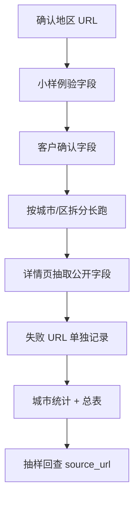

# FirmenABC Scraper Playbook

FirmenABC 企业信息采集的一份实战 playbook：从城市/地区列表页进入企业详情页，抽取公开展示的公司名称、邮箱、地址、电话、网站和来源 URL，最后生成可校验的数据文件。

[快速开始](#-快速开始) · [字段口径](docs/02-field-contract.md) · [长跑记录](docs/03-long-run-notes.md) · [交付校验](docs/04-delivery-checks.md)

| 输入 | 输出 | 最值得参考的点 |
|---|---|---|
| FirmenABC 城市/地区 URL 列表 | JSONL / CSV / 城市统计 / 失败列表 | 小样例验字段、分页覆盖、无邮箱保留、失败可回查 |

## 🚀 快速开始

运行脱敏样例校验：

```bash
npm install
npm run validate
npm run summary
```

跑一个 live 小样例：

```bash
npx playwright install chromium
npm run sample
```

默认只会按 `examples/targets.sample.json` 跑少量数据，输出到：

```text
output/firmenabc.sample.jsonl
output/firmenabc.sample.csv
```

如果现场返回 `429`，脚本会把地区列表页记成 `request_failed`，后续可以降速、换时间或接入已登录浏览器重试。

## 这次采集怎么走



这个流程的重点很简单：字段和格式确认清楚以后，全量采集才有意义。采集失败、无邮箱、字段缺失都要保留下来，方便后面解释。

## 输出长什么样

```json
{
  "state": "Niederösterreich",
  "district": "Baden",
  "city": "Baden",
  "industry": "Auto & Service",
  "company_name": "Example Auto Service GmbH",
  "email": "office@example-auto.test",
  "address": "Musterstraße 12, 2500 Baden",
  "phone": "+43 000 000000",
  "website": "https://example-auto.test",
  "source_url": "https://www.firmenabc.at/example-auto-service-gmbh_AB12",
  "scraped_at": "2026-05-11T10:00:00.000Z",
  "status": "ok",
  "note": ""
}
```

字段说明见 [docs/02-field-contract.md](docs/02-field-contract.md)。

## 我真正想留下来的经验

这类企业目录采集，最容易低估的是交付口径。

客户要邮箱，但页面上很多企业没有公开邮箱。如果脚本只保留有邮箱的企业，最终数据会看起来更干净，但覆盖范围会失真。我后来采用的口径是：公司名称和地址能拿到就保留，邮箱缺失就留空，`status` 写成 `no_email`。

还有一个坑是全量长跑。地区页可能有很多分页，详情页也会偶发请求失败。全量脚本不能只追求快，要能分城市输出、能续跑、能重试、能留下失败 URL。最后交付时，统计表和失败列表跟主数据一样重要。

## 文件结构

```text
scripts/
  collect_sample.mjs      跑少量 live 样例
  validate_output.mjs     校验 JSONL 字段、邮箱、source_url、重复
  build_summary.mjs       生成城市统计 Markdown

examples/
  targets.sample.json     地区 URL 样例
  firmenabc.sample.jsonl  脱敏输出样例

docs/
  01-sample-first.md      小样例确认字段
  02-field-contract.md    字段口径
  03-long-run-notes.md    长跑、分页、续跑记录
  04-delivery-checks.md   交付前怎么验
```

## 命令

校验样例：

```bash
node scripts/validate_output.mjs examples/firmenabc.sample.jsonl
```

生成统计：

```bash
node scripts/build_summary.mjs examples/firmenabc.sample.jsonl --output output/summary.sample.md
```

跑 live 小样例：

```bash
node scripts/collect_sample.mjs \
  --targets examples/targets.sample.json \
  --limit 5 \
  --output output/firmenabc.sample.jsonl
```

## 交付时我会看什么

- 每个目标城市/区是否都有记录和统计。
- 每条记录是否有 `source_url`。
- 邮箱格式是否正常。
- 没有邮箱的企业是否被保留。
- 失败 URL 是否单独列出。
- 是否能抽样回到 FirmenABC 页面核对字段。

## License

MIT
